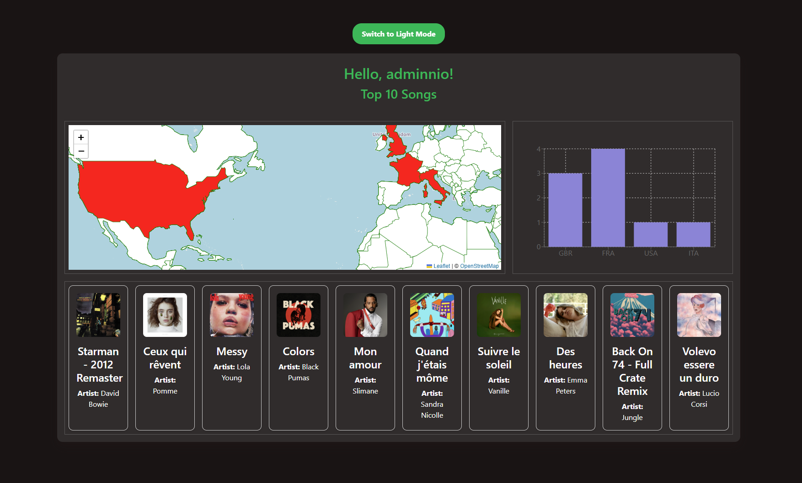

# Authentication and Spotify Analytics Application

## Overview
This repository contains a full-stack application that combines
**secure user authentication** with **Spotify-based music analytics**. 

It is designed with architectural flexibility in mind to support both: 
* **Two-tier architecture** - decoupled frontend/backend for full utilization of React Router and modern web practices
* **Single-server deployment** - building the frontend and serving it as a static resource from the backend server. 

Detailed information on local set up for either solution is well described in the two sub-repositories. 

**Authentication & Security**: 
- Secure registration and login using **Spring Security 6**.
- Encrypted user data stored in a **MySQL database**.
- Authentication powered by **JWT**.

**Spotify Integration & Analytics**
Authenticated users can connect their **Spotify account** via OAuth. Upon connection, the system fetches user listening data and presents it in a visual dashboard. 
* Displays top tracks and listening patterns based on country distribution
* Enriches raw Spotify data with **[MusicBrainz](https://github.com/metabrainz/musicbrainz-server)** - a community-powered music encyclopedia

## Demo 
Note: each page has a light/dark-mode toggle
### Login and Register Page
| Login | Register |
|------|-------|
| |  
### Spotify Analytics Page
First example: 

## Installation and Usage
### Prerequisites
- Node.js (>= 16.0)
- Java (>= 17)
- MySQL Database

### Setup
Clone the repo and navigate to the `backend` and `frontend` folders for detailed information about each. 

## Contributing
Contributions are welcome to enhance this project! Feel free to fork the repo, open issues, or submit pull requests.
1. Fork this repository.
2. Create a new branch 
3. Commit your changes 
4. Push to the branch 
5. Open a Pull Request.

## License
This project is licensed under the MIT License. See the [LICENSE](LICENSE.txt) file for details.
