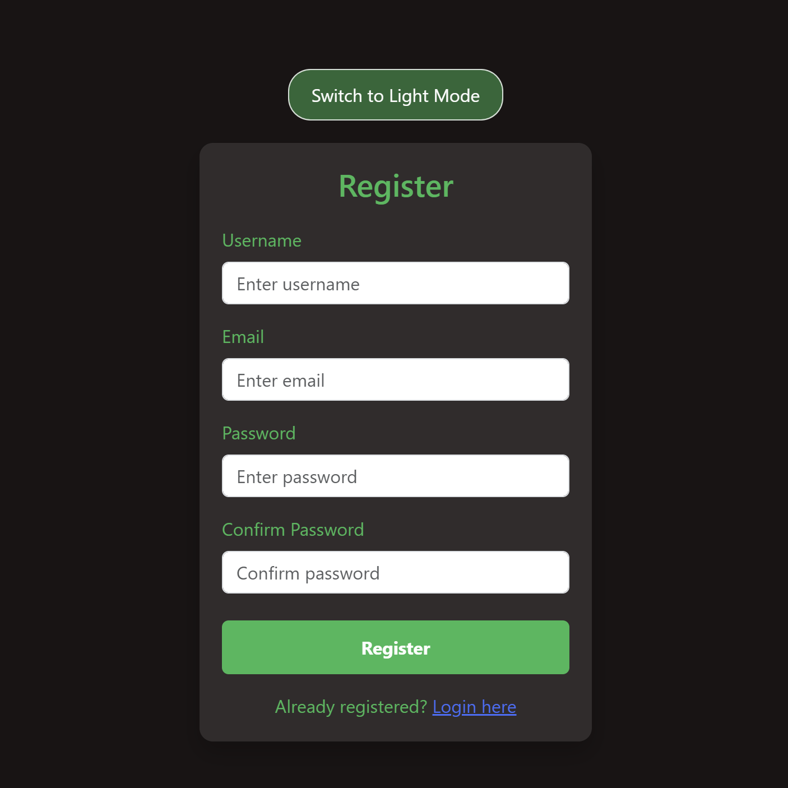

# Authentication Application

## Introduction
This repository showcases a full-stack 
**Registration and Authentication Application**, built with modern tools to deliver a secure and efficient user experience. It features a robust backend for user authentication and a sleek, responsive frontend interface.

**Features at a glance**:
- Secure registration and login using **Spring Boot** and **Spring Security**.
- Encrypted user data stored in a **MySQL database**.
- Authentication powered by **JWT** (JSON Web Tokens).
- A responsive **React frontend** bundled with **Vite** for optimal performance. 

## Demo 
### Login Page

| dark | light |
|------|-------|
|  |  

### Register Page

| dark | light |
|------|-------|
|  |  

## Installation and Usage
### Prerequisites
- Node.js (>= 16.0)
- Java (>= 17)
- MySQL Database

### Setup
Clone the repo and navigate to the `backend` and `frontend` folders for detailed information about each. 

## Roadmap 
- [x] Basic Registration and Login
- [x] JWT-based Authentication
- [x] Docker containerization
- [ ] Minikube deploy
- [ ] Forgot Password Flow
- [ ] Spotify Integration: Music analytics on the dashboard
- [ ] Deploy to cloud for a live demo

## Contributing
Contributions are welcome to enhance this project! Here's how you can help:
1. Fork this repository.
2. Create a new branch 
3. Commit your changes 
4. Push to the branch 
5. Open a Pull Request.

## License
This project is licensed under the MIT License. See the [LICENSE](LICENSE.txt) file for details.
